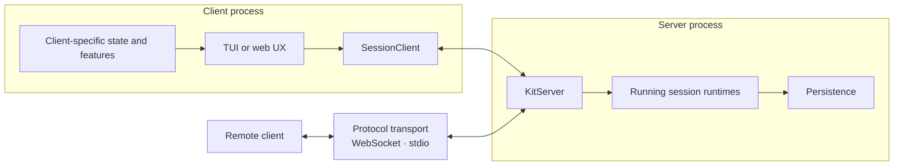
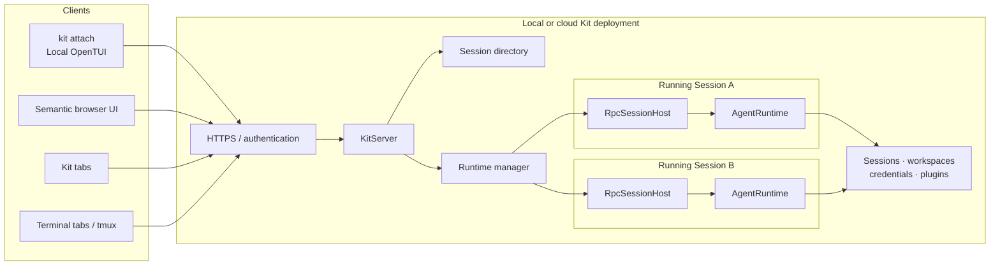

# 0029: Session client and repository boundaries

## Status

Accepted

Amended to use a server/client/protocol model. A same-process client calls the
server directly; protocol transports project server connections across process
or network boundaries.

## Context

Kit currently composes its runtime, persistence, remote protocols, terminal
shell, semantic browser client, and browser-hosted terminal inside one `app/`
package. That structure worked while Kit had one in-process interactive runtime,
but it obscures the boundaries needed for remote clients and a multi-session
server.

`kit attach` will run an OpenTUI renderer locally while controlling an
authoritative session on another machine. A future Kit server may keep
multiple sessions running concurrently. Separate terminal tabs, tmux panes,
browser tabs, or native Kit tabs may each attach to the same or different
sessions.

The repository needs explicit component boundaries before adding those modes.
In particular:

- the TUI must not require direct ownership of an `AgentRuntime`;
- one client view must bind to one authoritative running session;
- server-level session discovery must remain separate from session-level actions;
- protocol metadata must not be mixed into observable session state;
- shared types must have clear owners rather than accumulating in a generic
  `domain` package;
- the executable composition root should live in `apps/cli`.

## Implementation status

This ADR accepts a target architecture; it does not describe the current
repository or protocol as already migrated.

Today, protocol v2 exposes one mutable active session per `RpcSessionHost`.
Commands such as `new_session`, `open_session`, `switch_session`, `/new`, and
`/handoff` can change that active session for every connected client. The current
TUI also owns an `AgentRuntime` directly, and most components still live under
`app/`.

The target architecture requires a session-bound protocol revision, expected to
be version 3, that introduces server-level session discovery and creation plus
an explicit session-binding handshake or route. Once bound, a session connection cannot
change its binding. Existing session-changing commands must be removed, filtered,
or adapted into server-level operations that return a session identity for the
client shell to open.

A concrete `KitServer` now owns persistent session discovery and creation,
running-session startup, bound connections, and shutdown. It deliberately runs
at most one in-process session until runtime cwd handling and prompt-template
caches are session-scoped. Repository extraction, concurrent running sessions,
the session-bound protocol, and the shared session client remain future work.

## Decision

### Architectural components

Kit has three primary system components:

- the **server**, which is the authoritative backend and session manager;
- **clients**, which bind to individual sessions, render a UX, and may add
  client-specific behavior;
- the **protocol and transports**, which project server connections to remote
  clients.

A client in the server process calls `KitServer` and its bound connection
directly. A client in another process reaches those operations through a
protocol transport. Local composition does not add a pass-through transport.



The target repository shape is:

```text
apps/
├── cli/                # OpenTUI client and local/remote composition
├── web/                # semantic browser client
└── web-tui/            # browser terminal client

packages/
├── runtime/            # AgentRuntime and authoritative session behavior
├── persistence/        # session storage, sidecars, and migrations
├── protocol/           # records, validation, and transport contracts
├── server/             # backend, session manager, and bound connections
├── session-client/     # shared client state, reducer, and client API
├── tui/                # OpenTUI presentation
└── plugin-sdk/         # public plugin contracts
```

These may begin as private workspace packages. A package should exist to enforce
a meaningful ownership or dependency boundary, not merely to hold types.

### Multi-session server model

A remote Kit server may own multiple running session runtimes:



The target server will ensure one runtime owner for each persisted session.
Multiple clients may bind to one running session, while other clients bind to
different sessions. The first implementation will use one WebSocket per client
view and one immutable session binding per WebSocket. Protocol-level
multiplexing of multiple sessions over one socket is deferred.

### Server client and session client

Server-level operations and bound-session operations use separate interfaces:

```ts
interface ServerClient {
	readonly state: ObservableState<ServerClientSnapshot>;

	connect(): Promise<void>;
	listSessions(options?: SessionListOptions): Promise<SessionSummary[]>;
	createSession(input: CreateSessionInput): Promise<SessionSummary>;
	attachSession(sessionId: string): Promise<SessionClient>;
	dispose(): Promise<void>;
}

interface SessionClient {
	readonly sessionId: string;
	readonly state: ObservableState<SessionClientSnapshot>;
	readonly effects: ClientEffectSource;

	readonly chat: ChatClient;
	readonly transcript: TranscriptClient;
	readonly models: ModelClient;
	readonly interactions: InteractionClient;
	readonly attachments?: AttachmentClient;
	readonly commands: CommandClient;
	readonly features: SessionFeatureClients;

	dispose(): Promise<void>;
}
```

`ServerClient.connect()` completes server capability negotiation.
`attachSession()` completes session capability negotiation and initial
synchronization before returning a client. Its core and optional feature facets,
including their authoritative constraints, are therefore stable for the returned
client's lifetime. Reconnection is managed internally; an incompatible server or
protocol transition disconnects the client instead of mutating its mounted API.

A `SessionClient` represents exactly one client-side binding to one authoritative
running session. It does not expose `switchSession`. Session selection belongs
to `ServerClient` and the application shell:

```text
SessionClient A
  -> ServerClient.attachSession(B)
  -> SessionClient B
  -> replace the current view or open a new tab
```

This makes session switching local to a client view instead of mutating the
active session for every client connected to a server. A bound `SessionClient`
does not surface commands that replace its session binding. Session-creating
workflows such as new-session and handoff must return a target session identity
to the shell, which decides whether to replace the current view or open another.

Server-scoped and bound-session commands use separate protocol types and
validation paths. A session transport atomically installs its event listener and
returns a complete snapshot plus a high-water cursor; later records are delivered
exactly once and in order. Records caused by a command are delivered before that
command's response resolves. Transports own connection lifecycle, reconnect,
replay, and snapshot fallback.

Protocol values are limited to canonical wire-safe values. In-process transports
must validate and clone commands, records, and responses just like network
transports, so local behavior cannot depend on mutable references, functions,
binary objects, or values that JSON would transform. Binary attachment content
uses bounded base64 chunk operations with contiguous offsets. Read responses
include `nextOffset`, `totalBytes`, and `complete`; commit may verify an expected
SHA-256 digest and returns authoritative attachment metadata.

### Observable state

The client exposes immutable, structurally shared snapshots:

```ts
interface ObservableState<T> {
	getSnapshot(): T;
	subscribe(listener: (snapshot: T) => void): () => void;
}
```

```ts
type SessionClientSnapshot = {
	connection: {
		phase:
			| "connecting"
			| "synchronizing"
			| "live"
			| "disconnected";
		error?: string;
	};

	session: {
		id: string;
		name?: string;
		cwd: string;
		persistent: boolean;
	};

	agent: {
		status: "idle" | "running" | "retrying" | "aborting";
		activeTurnId?: string;
	};

	transcript: {
		messages: readonly ClientMessage[];
		activeMessage?: ClientMessage;
		offset: number;
		totalCount: number;
	};

	queue: {
		generation: number;
		count: number;
		previews: readonly QueuedMessagePreview[];
	};

	model: {
		provider: string;
		modelId: string;
		thinkingLevel?: string;
		contextUsage?: ContextUsage;
	};

	interactions: {
		generation: number;
		pending: readonly ClientInteraction[];
	};
};
```

Raw protocol records do not escape the session-client package. Its reducer owns
snapshot replacement, event sequencing, replay, transcript hydration, and
record deduplication before notifying a renderer.

Capabilities are negotiated contract metadata, not observable session state.
They are not included in `SessionClientSnapshot`. Feature support is represented
by the presence of a feature client, while limits are owned by the service they
constrain:

```ts
interface AttachmentClient {
	readonly constraints: {
		maxFilesPerPrompt: number;
		maxFileBytes: number;
		maxPromptBytes: number;
	};

	stage(source: AttachmentSource): Promise<StagedAttachment>;
	read(id: string): Promise<AttachmentContent>;
	remove(id: string): Promise<void>;
}
```

Low-level negotiated protocol information may be exposed separately for
diagnostics. Stream identity and replay cursors remain internal connection state
because they can change during recovery. An incompatible capability set
transitions the client to an error instead of silently changing its mounted API.

### Client command and feature facets

Core actions are grouped by responsibility rather than collected in one method
bag:

```text
SessionClient
├── chat             # prompt, steer, follow-up, abort, queue mutation
├── transcript       # pagination and message recovery
├── models           # model and thinking selection
├── interactions     # responses to pending remote UI requests
├── attachments      # staging, removal, and content access
├── commands         # transport-neutral command listing/execution
└── features
    ├── files?        # remote file suggestions, reads, and tree listing
    ├── review?       # review state, files, and submission
    ├── scratchpad?   # guarded reads and updates
    ├── subagents?
    ├── mcp?
    ├── releases?
    └── chrome?
```

Feature clients own and export their own contracts and data types. An attached
TUI must use these services rather than reading its local filesystem, Git state,
or session storage for a remote workspace.

### Client effects and renderer state

One-time effects use a separate semantic event source:

```ts
type SessionClientEffect =
	| { type: "toast"; toast: ClientToast }
	| { type: "open-url"; url: string }
	| { type: "notification"; title: string; message: string }
	| { type: "resynchronized"; reason: string };
```

Renderers decide how to present each effect. Protocol records remain private to
the client implementation.

The following state remains renderer-owned and does not enter
`SessionClientSnapshot`:

- focus and active workspace tabs;
- pickers, overlays, and dialog layout;
- composer cursor and unsent drafts;
- theme and keybindings;
- terminal dimensions and scroll positions;
- local review selection and editing state;
- toast timing and platform effects.

```text
Authoritative session state -> SessionClient
Client-local workflow state  -> renderer controllers
Visual and focus state        -> renderer
```

### Local and remote connections

Local clients call the server connection directly. Remote clients use a
protocol implementation of the same connection behavior:

```text
Local
  OpenTUI
    -> SessionClient
    -> KitServerConnection
    -> AgentRuntime

Remote
  OpenTUI or web UI
    -> SessionClient
    -> WebSocketSessionConnection
    -> KitServer (in another process)
    -> AgentRuntime
```

There is no in-process transport or embedded adapter. `SessionClient` owns the
shared reduction and semantic API; its local connection is the concrete
`KitServerConnection`. When the WebSocket path is implemented, the smallest
connection contract needed by both concrete connections will be extracted with
those consumers.

Platform operations remain outside the session client. The TUI receives a
session client plus terminal/platform services for clipboard, notifications,
terminal title, local settings, and process lifecycle.

### Native and external tabs

Each native Kit session tab owns an independent session client and local
presentation state:

```text
Kit window
├── Session A tab
│   ├── SessionClient A
│   ├── composer draft A
│   ├── workspace state A
│   └── scroll state A
└── Session B tab
    ├── SessionClient B
    ├── composer draft B
    ├── workspace state B
    └── scroll state B
```

Terminal tabs, tmux panes, and browser tabs provide the same model naturally by
running independent client views. They may share a server and may attach to the
same or different sessions.

### Type ownership

Kit will not introduce a generic `domain` package. Types live with the package
that defines their meaning:

```text
runtime
├── AgentRuntimeEvent
├── RuntimeMessage
└── RuntimeTurn

protocol
├── RpcCommand
├── RpcResponse
├── RpcEvent
└── SyncRecord

session-client
├── SessionClientSnapshot
├── ClientMessage
└── ClientInteraction

persistence
├── StoredSession
├── StoredMessageEntry
└── migration representations
```

Similar shapes at different boundaries are projected explicitly:

```text
RuntimeMessage
  -> server projection
  -> ProtocolMessage
  -> client reducer
  -> ClientMessage
```

This intentional duplication prevents an internal runtime change from silently
becoming a protocol or renderer contract change.

### Executable composition

`apps/cli` is the composition root for all command-line modes:

```text
kit
  KitServer + SessionClient + TUI

kit attach <server>
  WebSocketTransport + SessionClient + TUI

kit --web
  KitServer + WebSocket transport + semantic web client

kit --rpc
  KitServer + stdio transport

kit --web-tui
  KitServer + SessionClient + server-side TUI
  browser client <-> terminal-byte bridge <-> server-side TUI
```

## Dependency rules

- `runtime` does not import renderer or transport implementations.
- `persistence` implements runtime-owned persistence ports.
- `protocol` defines wire contracts independently of runtime types.
- `server` owns authoritative sessions and projects them into protocol records.
- `session-client` maps protocol records into client-owned state and is
  independent of the concrete transport.
- `tui` consumes session-client contracts rather than `AgentRuntime`.
- only application composition roots wire concrete implementations together.
- a package is not created solely to hold shared types.

## Migration direction

The repository will move toward this architecture incrementally:

1. Extract the existing protocol records and validation.
2. Extract the browser's DOM-independent services and reducer into the
   session-client package.
3. Implement `KitServer` session management, introducing server-side types and
   seams only with their first concrete consumers.
4. Implement `SessionClient` directly over `KitServerConnection`.
5. Adapt transcript and composer workflows to consume `SessionClient`.
6. Move remaining TUI features behind explicit client or platform boundaries.
7. Extract runtime, persistence, server, and renderer packages as their import
   boundaries become enforceable.
8. Design and implement the session-bound protocol revision.
9. Add the WebSocket transport and `kit attach`.
10. Add client-local session switching and, later, native session tabs.

## Consequences

### Positive

- Local and attached TUI modes share one semantic client contract.
- A server can host multiple authoritative sessions without global session
  switching between unrelated clients.
- Browser, terminal, tmux, and native-tab presentations remain independent of
  server multiplexing.
- Runtime, protocol, and renderer types have explicit owners.
- Capability and transport details do not pollute observable session state.
- Package boundaries can enforce the intended dependency direction.

### Trade-offs

- Existing TUI controllers that directly use `AgentRuntime`, filesystem APIs,
  Git, or storage must move behind client and platform ports.
- Runtime, protocol, and client projections will intentionally duplicate some
  data shapes.
- Direct and remote connection implementations require shared conformance tests
  to prevent protocol-specific semantic drift.
- Feature parity becomes explicit: unsupported remote features must be absent
  or disabled rather than accidentally operating on the client machine.
- Converting the current package into workspaces adds build and repository
  migration work before `kit attach` is complete.

## Deferred

- multiplexing multiple session channels over one WebSocket;
- resource and idle-eviction policy for many running session runtimes;
- the final `kit attach` CLI and authentication contract;
- native session-tab interaction design;
- server-rendered OpenTUI over SSH;
- publishing internal workspace packages independently.

## Related

- [`0003-custom-shell.md`](0003-custom-shell.md)
- [`0026-headless-rpc-mode.md`](0026-headless-rpc-mode.md)
- [`0027-remote-session-server.md`](0027-remote-session-server.md)
- [`0028-minimal-web-client.md`](0028-minimal-web-client.md)
- [`../../../docs/features/rpc-mode.md`](../../../docs/features/rpc-mode.md)
- [`../../../backlog/remote-session-server.md`](../../../backlog/remote-session-server.md)
